# COMP3133 - Lab Test 1 - Chat App

## Woohyuk (Harry) Song | 101524575 

A real-time chat application with user authentication, room-based messaging, private messaging, and data persistence using MongoDB.

## Technologies
- Backend: Node.js, Express, Socket.io, Mongoose, MongoDB Atlas
- Frontend: HTML, CSS, Bootstrap, JavaScript

## Features
- User authentication (signup/login)
- Room-based group messaging
- Private one-on-one messaging
- Real-time typing indicators for both public and private chatting
- Message timestamps
- Online user list
- Message data persistence with MongoDB
- Real-time updates with Socket.io

## Project Structure
```
├── models/                 # MongoDB schemas
│   ├── User.js                 # User model
│   ├── GroupMessage.js         # Room message model
│   └── PrivateMessage.js       # Private message model
├── public/                 # Static files
│   ├── css/                # Styles
│   │   └── style.css           # Application styles
│   └── js/                 # JavaScript
│       ├── lobby.js            # Lobby page logic
│       ├── room.js             # Room chat logic
│       ├── private.js          # Private chat logic
│       ├── login.js            # Login form handling
│       └── signup.js           # Signup form handling
├── views/                  # HTML pages
│   ├── lobby.html              # Main lobby (room/user selection)
│   ├── room.html               # Room chat page
│   ├── private.html            # Private chat page
│   ├── login.html              # Login page
│   └── signup.html             # Signup page
├── server.js               # Express server setup
├── socketHandler.js        # Socket.io event handlers
├── .env                    # Environment variables (MongoDB URI)
└── package.json            # Dependencies

```

## Setup Instructions

1. Install dependencies:
```bash
npm install
```

2. Create a `.env` file. You can copy the contents of the .env.example provided.

3. Start the server:
```bash
node server.js
```

4. Open your browser and navigate to:
```
http://localhost:3000
```

## MongoDB Collections

- **users**: Stores user accounts (username, firstname, lastname, password, createon)
- **groupmessages**: Stores room messages (from_user, room, message, date_sent)
- **privatemessages**: Stores private messages (from_user, to_user, message, date_sent)

## Screenshots + Explanation
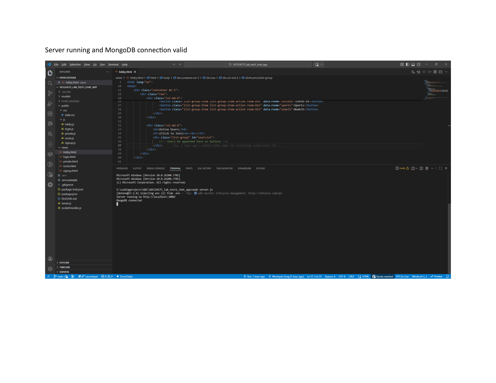
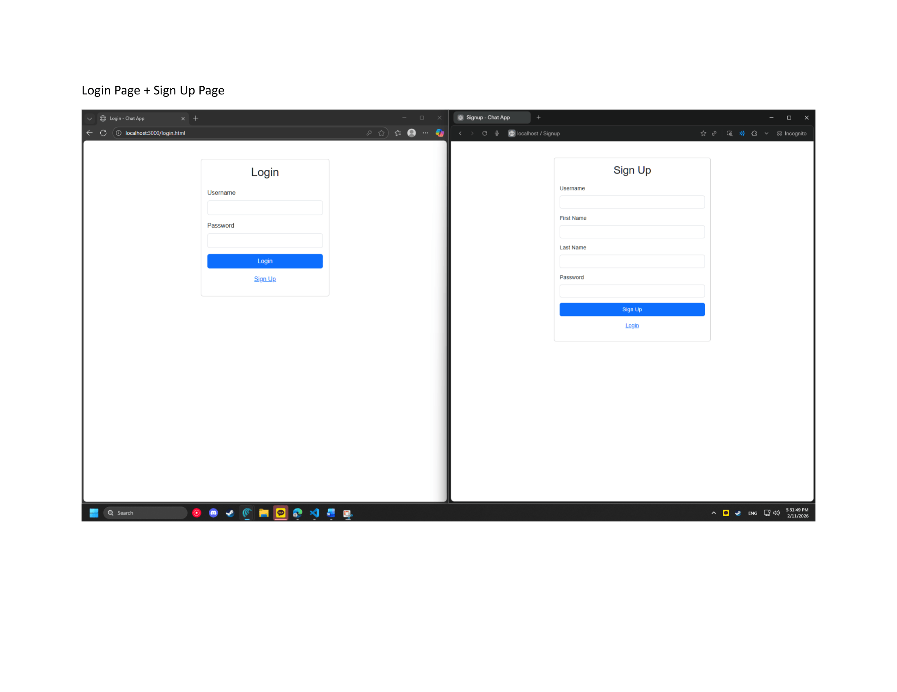
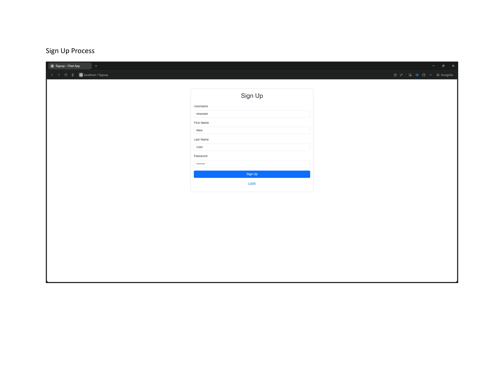
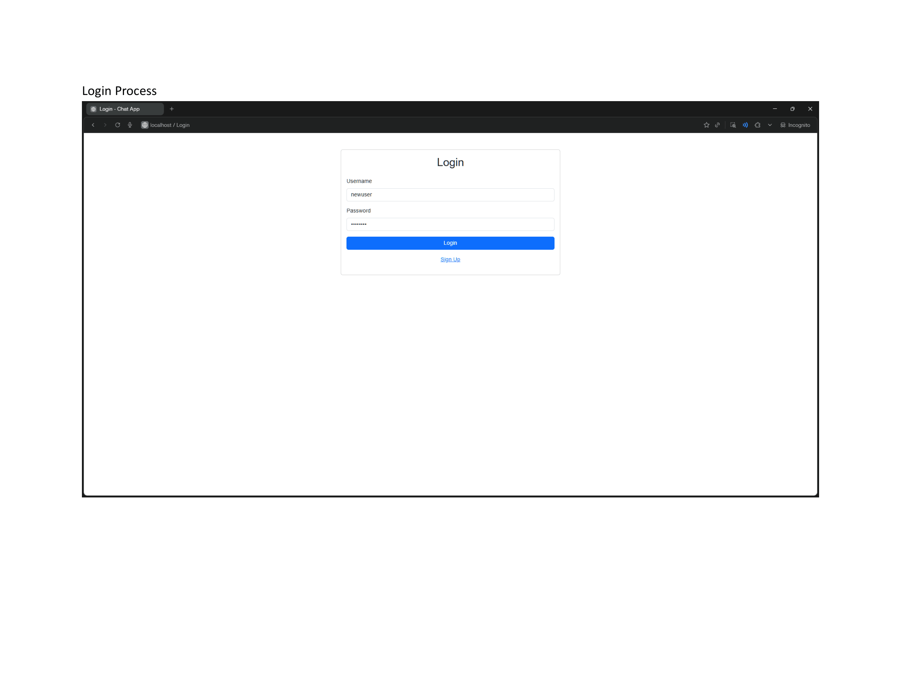
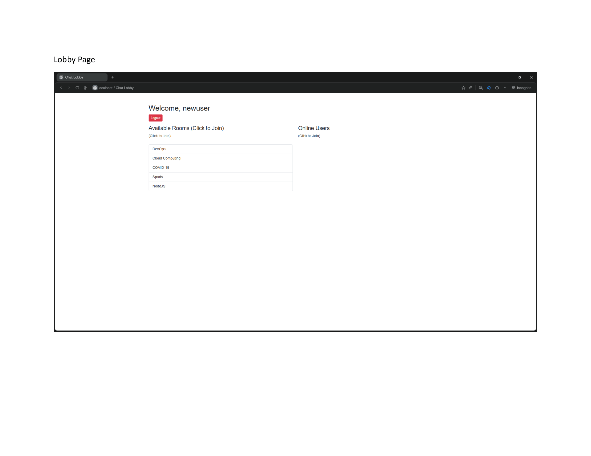
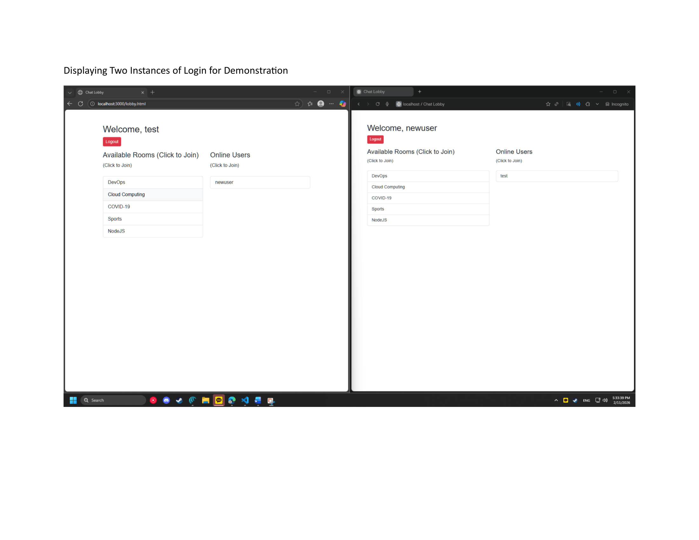
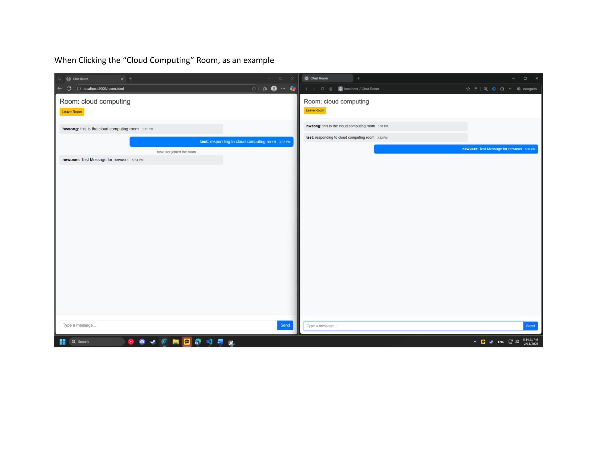
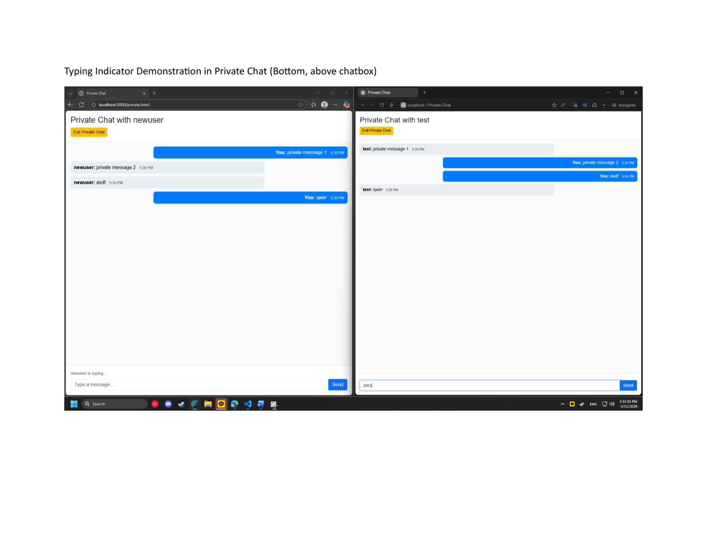
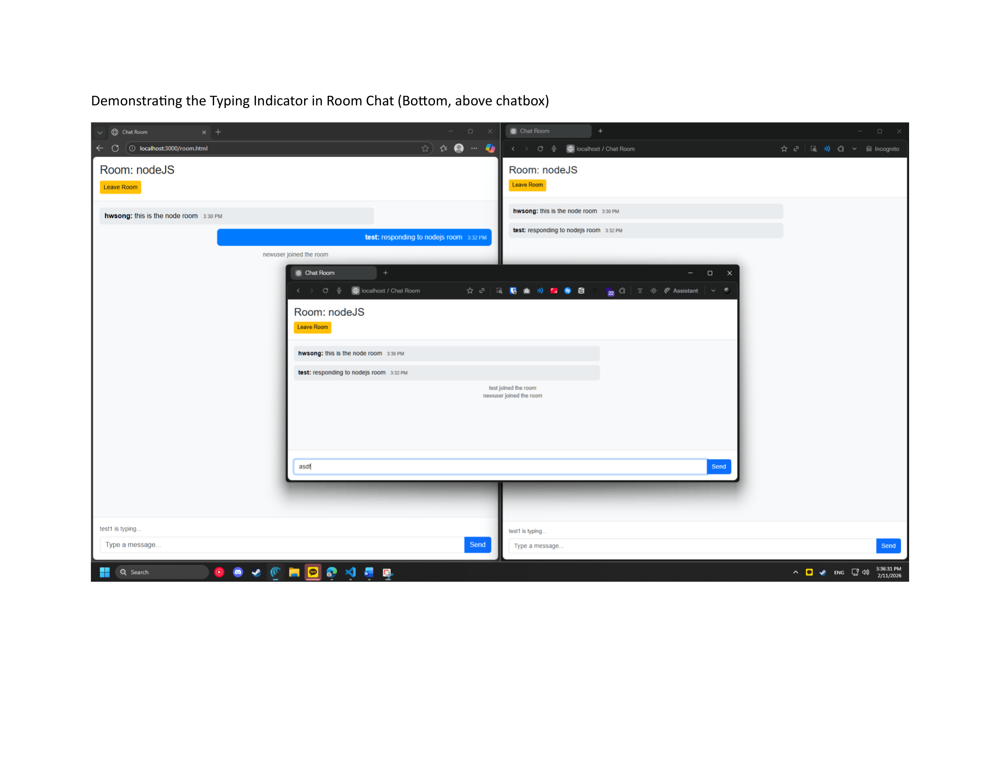
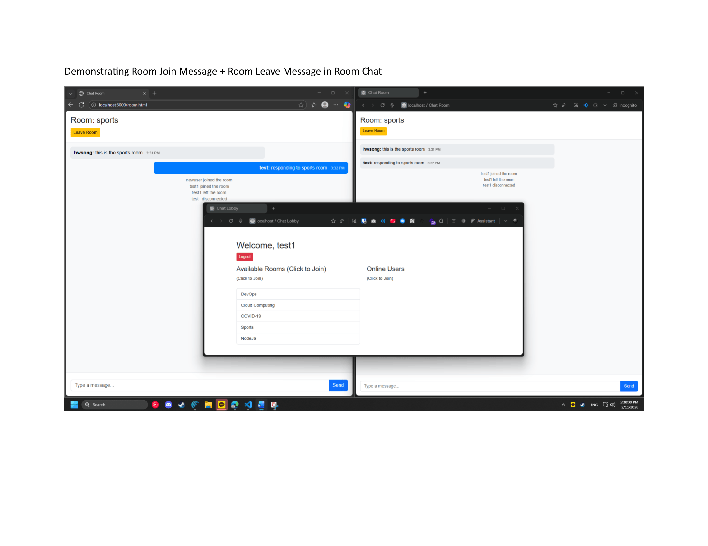
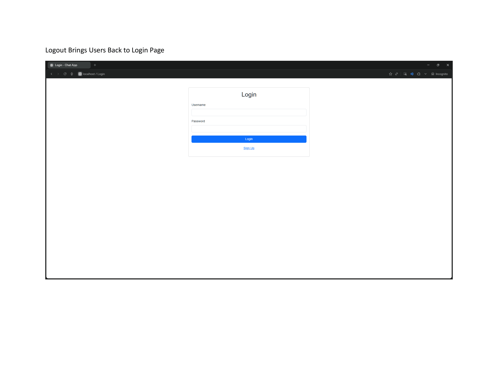